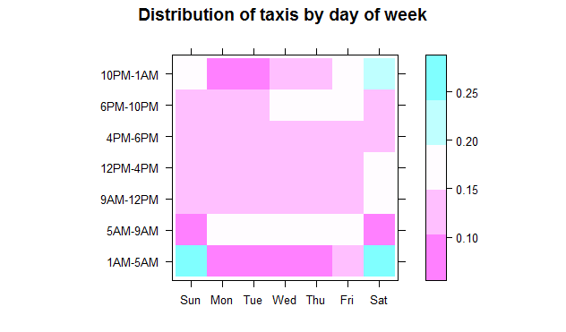

# Examining the new columns

Let's examine the new columns we created to make sure the transformation more or less worked.  We use the `rxSummary` function to get some statistical summaries of the data.  The `rxSummary` function is akin to the `summary` function in base R \(aside from the fact that `summary` only works on a `data.frame`\) in two ways:

* It provides numerical summaries for numeric columns \(except for percentiles, for which we use the `rxQuantile` function\).
* It provides counts for each level of the factor columns.

We use the same _formula notation_ used by many other R modeling or plotting functions to specify which columns we want summaries for.  For example, here we want to see summaries for `pickup_hour` and `pickup_dow` \(both factors\) and `trip_duration` \(numeric, in seconds\).

```R
rxs1 <- rxSummary( ~ pickup_hour + pickup_dow + trip_duration, nyc_xdf)
# we can add a column for proportions next to the counts
rxs1$categorical <- lapply(rxs1$categorical, function(x) cbind(x, prop = round(prop.table(x$Counts), 2)))
rxs1
```

```Rout
Call:
rxSummary(formula = ~pickup_hour + pickup_dow + trip_duration, 
    data = nyc_xdf)

Summary Statistics Results for: ~pickup_hour + pickup_dow + trip_duration
Data: nyc_xdf (RxXdfData Data Source)
File name: yellow_tripdata_2016.xdf
Number of valid observations: 69406520 

 Name          Mean     StdDev   Min        Max      ValidObs MissingObs
 trip_duration 933.9168 119243.5 -631148790 11538803 69406520 0         

Category Counts for pickup_hour
Number of categories: 7
Number of valid observations: 69406520
Number of missing observations: 0

 pickup_hour Counts   prop
 1AM-5AM      3801430 0.05
 5AM-9AM     10630653 0.15
 9AM-12PM     9765429 0.14
 12PM-4PM    13473045 0.19
 4PM-6PM      7946899 0.11
 6PM-10PM    16138968 0.23
 10PM-1AM     7650096 0.11

Category Counts for pickup_dow
Number of categories: 7
Number of valid observations: 69406520
Number of missing observations: 0

 pickup_dow Counts   prop
 Sun         9267881 0.13
 Mon         8938785 0.13
 Tue         9667525 0.14
 Wed         9982769 0.14
 Thu        10398738 0.15
 Fri        10655022 0.15
 Sat        10495800 0.15
```

Separating two variables by a colon \(`pickup_dow:pickup_hour`\) instead of a plus sign \(`pickup_dow + pickup_hour`\) allows us to get summaries for each combination of the levels of the two factor columns, instead of individual ones.

```R
rxs2 <- rxSummary( ~ pickup_dow:pickup_hour, nyc_xdf)
rxs2 <- tidyr::spread(rxs2$categorical[[1]], key = 'pickup_hour', value = 'Counts')
row.names(rxs2) <- rxs2[ , 1]
rxs2 <- as.matrix(rxs2[ , -1])
rxs2
```

```Rout
    1AM-5AM 5AM-9AM 9AM-12PM 12PM-4PM 4PM-6PM 6PM-10PM 10PM-1AM
Sun 1040233  740157  1396409  1980752 1032434  1697529  1380367
Mon  304474 1630951  1268326  1838143 1133728  2096219   666944
Tue  278407 1840134  1382381  1882356 1151837  2390506   741904
Wed  313809 1854757  1417953  1880896 1142071  2508618   864665
Thu  354646 1871828  1428985  1922502 1165535  2634023  1021219
Fri  553159 1766482  1406979  1922542 1173163  2516285  1316412
Sat  956702  926344  1464396  2045854 1148131  2295788  1658585
```

In the above case, the individual counts are not as helpful to us as proportions from those counts, and for comparing across different days of the week, we want the proportions to be based on totals for each column, not the entire table.  We ask for proportions based on column totals by passing the 2 to as second argument to the `prop.table` function. We can also visually display the proportions using the `levelplot` function.

```R
levelplot(prop.table(rxs2, 2), cuts = 4, xlab = "", ylab = "", main = "Distribution of taxis by day of week")
```



Interesting results manifest themselves in the above plot:

1. Early morning \(between 5AM and 9AM\) taxi rides are predictably at their lowest on weekends, and somewhat on Mondays \(the Monday blues effect?\).
2. During the business hours \(between 9AM and 6PM\), about the same proportion of taxi trips take place \(about 42 to 45 percent\) for each day of the week, including weekends.  In other words, regardless of what day of the week it is, a little less than half of all trips take place between 9AM and 6PM.
3. We can see a spike in taxi rides between 6PM and 10PM on Thursday and Friday evenings, and a spike between 10PM and 1AM on Friday and especially Saturday evenings. Taxi trips between 1AM and 5AM spike up on Saturdays \(the Friday late-night outings\) and even more so on Sundays \(the Saturday late-night outings\).  They fall sharply on other days, but right slightly on Fridays \(in anticipation!\). In other words, more people go out on Thursdays but don't stay out late, even more people go out on Fridays and stay even later, but Saturday is the day most people choose for a really late outing.

