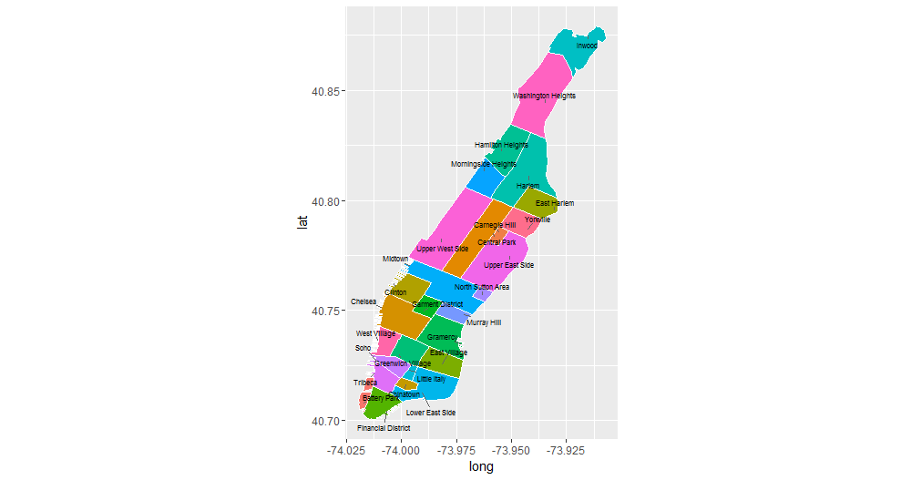

# Plotting neighborhoods

We now add another set of features to the data: pickup and drop-off neighborhoods.  Getting neighborhood information from longitude and latitude is not something we can hardcode easily, so instead we rely a few GIS packages and a **shapefile** [(courtesy of Zillow)](http://www.zillow.com/howto/api/neighborhood-boundaries.htm).  A shapefile is a file that contains geographical information inside of it, including information about boundaries separating geographical areas.  The `ZillowNeighborhoods-NY.shp` file has information about NYC neighborhoods.

We begin by plotting a map of Manhattan neighborhoods, so we can see the neighborhood boundaries and familiarize ourselves with their names. The details of how the plot below was generated is beyond the discussion of this course, and we recommend checking the documentation for the `maptools` library for more details.

```R
library(rgeos)
library(maptools)

nyc_shapefile <- readShapePoly('ZillowNeighborhoods-NY/ZillowNeighborhoods-NY.shp')
mht_shapefile <- subset(nyc_shapefile, str_detect(CITY, 'New York City-Manhattan'))

mht_shapefile@data$id <- as.character(mht_shapefile@data$NAME)
mht.points <- fortify(gBuffer(mht_shapefile, byid = TRUE, width = 0), region = "NAME")
mht.df <- inner_join(mht.points, mht_shapefile@data, by = "id")

library(dplyr)
mht.cent <- mht.df %>%
  group_by(id) %>%
  summarize(long = median(long), lat = median(lat))

library(ggrepel)
ggplot(mht.df, aes(long, lat, fill = id)) + 
  geom_polygon() +
  geom_path(color = "white") +
  coord_equal() +
  theme(legend.position = "none") +
  geom_text_repel(aes(label = id), data = mht.cent, size = 3)
```



