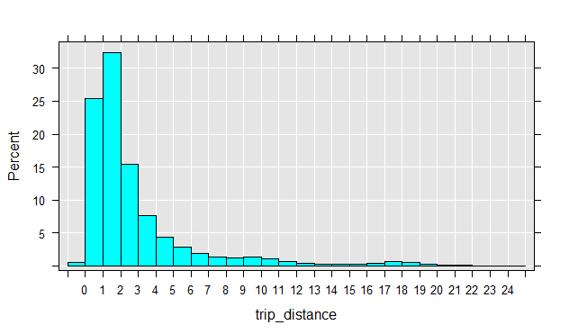

# Examining trip distance

Data is messy and often needs to be cleaned before we can do much with it.  Looking at the above summaries and snapshots of the data, we can often tell how the data needs to be cleaned.  Here are some suggestions:

- *Have missing values been properly accounted for?* In flat files missing values have often a different representation as NAs. For example, missing values for character columns can have an empty entry or one with a catchall term such as 'other' or 'n/a', while missing numeric columns can have empty cells, or use NULL or 999. Sometimes, different codes are used to delineate different kinds of missing values (such as data missing because the information is not relevant, or missing because the information was not provided).  When recoding missing values to NAs in R, it's important to account for such differences.
- *Do column types match our expectation?* This is an important consideration, and we dealt with it by explicitly providing column types prior to reading the data.  This is the preferred approach since it avoids unnecessary processing, especially the processing that takes place when R reads in a column as a `factor` when it's not needed.  Columns with high cardinality that are formatted as `factor` add a lot of overhead to R session.  Such columns often don't need to be `factor` and should remain as `integer` or `character` columns.  If we don't know ahead of time which columns should be factors and which not, or if we need to clean a column before turning it into a `factor`, then we can suppress the automatic conversion of `character` columns to `factor` columns by setting `stringsAsFactors = FALSE` when we run `rxImport` or specifying all non-numeric columns to be `character` columns.
- *Are there outliers in the data and do they seem legitimate?* Often, the question of what an outlier is depends on our understanding of the data and tolerance for deviations from the average patterns in the data.  In the NYC Taxi dataset, consider the following cases: (1) A passenger might take a cab and use it all day for running multiple errands, asking the driver to wait for him.  (2) A passenger might intend to tip 5 dollars and accidentally press 5 twice and tip 55 dollars for a trip that cost 40 dollars.  (3) A passenger could get into a argument with a driver and leave without paying.  (4) Multi-passenger trips could have one person pay for everyone or each person pay for himself, with some paying with a card and others using cash. (5) A driver can accidentally keep the meter running after dropping someone off.  (6) Machine logging errors can result in either no data or wrong data points.  In all of these cases, even assuming that we can easily capture the behavior (because some combination of data points falls within unusual ranges) whether or not we consider them *legitimate* still depends on what the purpose of our analysis is.  An outlier could be noise to one analysis and a point of interest to another.

Now that we have the data with candidate outliers, we can examine it for certain patterns.  For example, we can plot a histogram of `trip_distance` and notice that almost all trips traveled a distance of less than 20 miles, with the great majority going less than 5 miles.


```R
rxHistogram( ~ trip_distance, nyc_xdf, startVal = 0, endVal = 25, histType = "Percent", numBreaks = 20)
```



There is a second peak around around trips that traveled between 16 and 20, which is worth examining further.  We can verify this by looking at which neighborhoods passengers are traveling from and to.


```R
rxs <- rxSummary( ~ pickup_nhood:dropoff_nhood, nyc_xdf, rowSelection = (trip_distance > 15 & trip_distance < 22))
head(arrange(rxs$categorical[[1]], desc(Counts)), 10)
```

```Rout
       pickup_nhood            dropoff_nhood Counts
1           Midtown Gravesend-Sheepshead Bay   2517
2   Upper East Side Gravesend-Sheepshead Bay   1090
3           Midtown  Douglastown-Little Neck   1013
4           Midtown                  Midtown    978
5  Garment District Gravesend-Sheepshead Bay    911
6           Midtown              Bensonhurst    878
7          Gramercy Gravesend-Sheepshead Bay    784
8           Jamaica          Upper West Side    775
9           Chelsea Gravesend-Sheepshead Bay    729
10          Midtown                Bay Ridge    687
```

As we can see, `Gravesend-Sheepshead Bay` often appears as a destination, and surprisingly, not as a pickup point.  We can also see trips from and to `Jamaica`, which is the neighborhood closest to the JFK airport.

