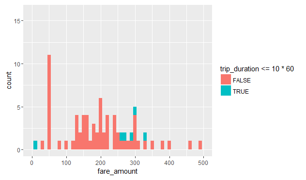

# Examining outliers

Let's see how we could use `RevoScaleR` to examine the data for outliers.  Our approach here is rather primitive, but the intent is to show how the use the tools:  We use `rxDataStep` and its `rowSelection` argument to extract all the data points that are candidate outliers.  By leaving the `outFile` argument we output the resulting dataset into a `data.frame` which we call `odd_trips`.  Lastly, if we are too expansive in our outlier selection criteria, then resulting `data.frame` could still have too many rows (which could clog the memory and make it slow to produce plots and other summaries).  So we create a new column `u` and populate it with random uniform numbers between 0 and 1, and we add `u < .05` to our `rowSelection` criteria.  We can adjust this number to end up with a smaller `data.frame` (threshold closer to 0) or a larger `data.frame` (threshold closer to 1).

```R
# outFile argument missing means we output to data.frame
odd_trips <- rxDataStep(nyc_xdf, rowSelection = (
  u < .05 & ( # we can adjust this if the data gets too big
    (trip_distance > 50 | trip_distance <= 0) |
    (passenger_count > 5 | passenger_count == 0) |
    (fare_amount > 5000 | fare_amount <= 0)
)), transforms = list(u = runif(.rxNumRows)))

print(dim(odd_trips))
```

```Rout
[1] 93750    32
```

Since the dataset with the candidate outliers is a `data.frame`, we can use any R function to examine it.  For example, we limit `odd_trips` to cases where a distance of more than 50 miles was traveled, plot a histogram of the fare amount the passenger paid, and color it based on whether the trip took more or less than 10 minutes.

```R
odd_trips %>% 
  filter(trip_distance > 50) %>%
  ggplot() -> p

p + geom_histogram(aes(x = fare_amount, fill = trip_duration <= 10*60), binwidth = 10) +
  xlim(0, 500) + coord_fixed(ratio = 25)
```



As we can see, the majority of trips that traveled over 50 miles cost nothing or next to nothing, even though most of these trips took 10 minutes or longer.  It is unclear whether such trips were the result of machine error human error, but if for example this analysis was targeted at the company that owns the taxis, this finding would warrant more investigation.
