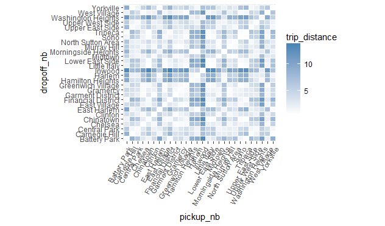

# Reordering neighborhoods

As our next task, we seek to find patterns between pickup and drop-off neighborhoods and other variables such as fare amount, trip distance, traffic and tipping. To estimate traffic by looking at the ratio of trip duration and trip distance, assuming that traffic is the most common reason for trips taking longer than they should.

For this analysis, we use the `rxCube` and `rxCrossTabs` are both very similar to `rxSummary` but they return fewer statistical summaries and therefore run faster.  With `y ~ u:v` as the formula, `rxCrossTabs` returns counts and sums, and `rxCube` returns counts and averages for column `y` broken up by any combinations of columns `u` and `v`.  Another important difference between the two functions is that `rxCrossTabs` returns an array but `rxCube` returns a `data.frame`.  Depending on the application in question, we may prefer one to the other (and of course we can always convert one form to the other by "reshaping" it, but doing so would involve extra work).

Let's see what this means in action: We start by using `rxCrossTabs` to get sums and counts for `trip_distance`, broken up by `pickup_nb` and `dropoff_nb`.  We can immediately divide the sums by the counts to get averages.  The result is called a **distance matrix** and can be fed to the `seriate` function in the `seriation` library to order it so closer neighborhoods appear next to each other (right now neighborhoods are sorted alphabetically, which is what R does by default with factor levels unless otherwise specified).

```R
rxct <- rxCrossTabs(trip_distance ~ pickup_nb:dropoff_nb, mht_xdf)
res <- rxct$sums$trip_distance / rxct$counts$trip_distance

library(seriation)
res[which(is.nan(res))] <- mean(res, na.rm = TRUE)
nb_order <- seriate(res)
```

We will use `nb_order` in a little while, but before we do so, let's use `rxCube` to get counts and averages for `trip_distance`, a new data point representing minutes spent in the taxi per mile of the trip, and `tip_percent`.  In the above example, we used `rxCrossTabs` because we wanted a matrix as the return object, so we could feed it to `seriate`.  We now use `rxCube` to get a `data.frame` instead, since we intend to use it for plotting with `ggplot2`, which is more easier to code using a long `data.frame` as input compared to a wide `matirx`.

```R
rxc1 <- rxCube(trip_distance ~ pickup_nb:dropoff_nb, mht_xdf)
rxc2 <- rxCube(minutes_per_mile ~ pickup_nb:dropoff_nb, mht_xdf, 
               transforms = list(minutes_per_mile = (trip_duration/60)/trip_distance))
rxc3 <- rxCube(tip_percent ~ pickup_nb:dropoff_nb, mht_xdf)
res <- bind_cols(list(rxc1, rxc2, rxc3))
res <- res[ , c('pickup_nb', 'dropoff_nb', 'trip_distance', 'minutes_per_mile', 'tip_percent')]
head(res)
```

```Rout
# A tibble: 6 × 5
      pickup_nb   dropoff_nb trip_distance minutes_per_mile tip_percent
         <fctr>       <fctr>         <dbl>            <dbl>       <dbl>
1  Battery Park Battery Park      1.015857        11.579629   11.394900
2 Carnegie Hill Battery Park      8.570623         3.944350   12.391030
3  Central Park Battery Park      6.277666         5.243241   10.326531
4       Chelsea Battery Park      2.995946         5.169887   11.992151
5     Chinatown Battery Park      1.771597         9.001305   10.292683
6       Clinton Battery Park      3.993806         4.839858    9.794098
```

We can start plotting the above results to see some interesting trends.

```R
library(ggplot2)
ggplot(res, aes(pickup_nb, dropoff_nb)) + 
  geom_tile(aes(fill = trip_distance), colour = "white") + 
  theme(axis.text.x = element_text(angle = 60, hjust = 1)) +
  scale_fill_gradient(low = "white", high = "steelblue") + 
  coord_fixed(ratio = .9)
```



The problem with the above plot is the order of the neighborhoods (which is alphabetical), which makes the plot somewhat arbitrary and useless.  But as we saw above, using the `seriate` function we found a more natural ordering for the neighborhoods, so we can use it to reorder the above plot in a more suitable way.  To reorder the plot, all we need to do is reorder the factor levels in the order given by `nb_order`.

```R
newlevs <- levels(res$pickup_nb)[unlist(nb_order)]
res$pickup_nb <- factor(res$pickup_nb, levels = unique(newlevs))
res$dropoff_nb <- factor(res$dropoff_nb, levels = unique(newlevs))

library(ggplot2)
ggplot(res, aes(pickup_nb, dropoff_nb)) + 
  geom_tile(aes(fill = trip_distance), colour = "white") + 
  theme(axis.text.x = element_text(angle = 60, hjust = 1)) +
  scale_fill_gradient(low = "white", high = "steelblue") + 
  coord_fixed(ratio = .9)
```


