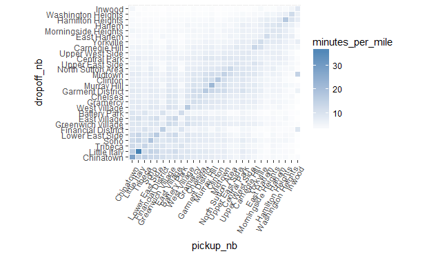
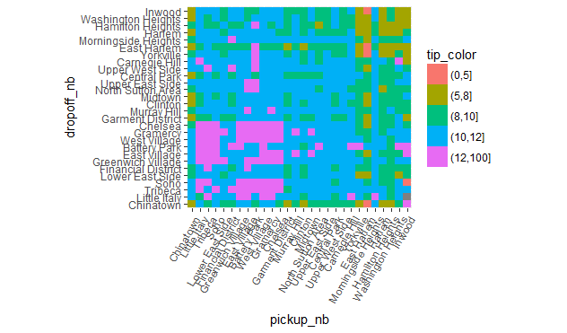

# Neighborhood trends

Since trip distances remain fix, but trip duration mostly is a function of how much traffic there is, we can plot a look at the same plot as the above, but for the `minutes_per_mile` column, which will give us an idea of which neighborhoods have the most traffic between them.

```R
ggplot(res, aes(pickup_nb, dropoff_nb)) + 
  geom_tile(aes(fill = minutes_per_mile), colour = "white") + 
  theme(axis.text.x = element_text(angle = 60, hjust = 1)) + 
  scale_fill_gradient(low = "white", high = "steelblue") + 
  coord_fixed(ratio = .9)
```



Another interesting question to consider is the relationship between the fare amount and how much passengers tip in relation to which neighborhoods they travel between.  We create another plot similar to the ones above, showing fare amount on a gray background color scale, and displaying how much passengers tipped on average for the trip.  To make it easier to visually see patterns in tipping behavior, we color-code the average tip based on whether it's over 12%, less than 12%, less than 10%, less than 8%, and less than 5%.

```R
res %>%
  mutate(tip_color = cut(tip_percent, c(0, 5, 8, 10, 12, 100))) %>%
  ggplot(aes(pickup_nb, dropoff_nb)) + 
  geom_tile(aes(fill = tip_color)) + 
  theme(axis.text.x = element_text(angle = 60, hjust = 1)) + 
  coord_fixed(ratio = .9)
```



Some interesting results stand out:

- Trips leaving Battery Park or the Financial District going to midtown or uptown neighborhoods seem to cost a little more than seems warranted, and same trips leaving Greenwich Village going to Chinatown.
- Trips into and out of Chinatown tip consistently low (below 10%), especially if traveling to or coming from midtown and uptown neighborhoods.
- The most generous tippers (around 12%) are the ones traveling between downtown neighborhoods (except for Chinatown).  The next most generous tippers (around 11%) are the ones traveling between midtown neighborhoods and downtown neighborhoods in either direction.  The worst tippers are the one traveling between uptown neighborhoods.


