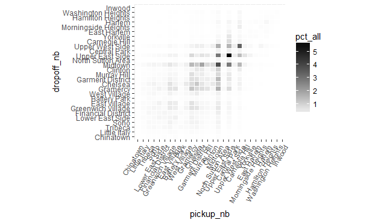
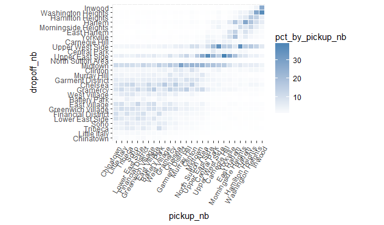
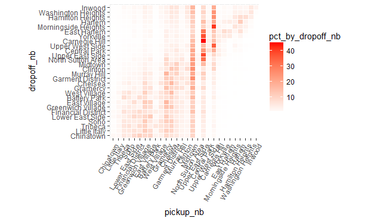

# Total and marginal distribution trips between neighborhoods

Let's focus our attention now the following important questions:
- Between which neighborhoods do the most common trips occur?  
- Assuming that a traveler leaves from a given neighborhood, which neighborhoods are they most likely to go to?
- Assuming that someone was just dropped off at a given neighborhood, which neighborhoods are they most likely to have come from?

To answer the above questions, we need to find the distribution (or proportion) of trips between any two neighborhoods, first as a percentage of total trips, then as a percentage of trips *leaving from* a particular neighborhood, and finally as a percentage of trips *going to* a particular neighborhood.

```R
rxc <- rxCube( ~ pickup_nb:dropoff_nb, mht_xdf)
rxc <- as.data.frame(rxc)

library(dplyr)
rxc %>% 
  filter(Counts > 0) %>%
  mutate(pct_all = Counts/sum(Counts) * 100) %>%
  group_by(pickup_nb) %>%
  mutate(pct_by_pickup_nb = Counts/sum(Counts) * 100) %>%
  group_by(dropoff_nb) %>%
  mutate(pct_by_dropoff_nb = Counts/sum(Counts) * 100) %>%
  group_by() %>%
  arrange(desc(Counts)) -> rxcs

head(rxcs)
```

```Rout
# A tibble: 6 × 6
         pickup_nb      dropoff_nb  Counts  pct_all pct_by_pickup_nb
            <fctr>          <fctr>   <dbl>    <dbl>            <dbl>
1  Upper East Side Upper East Side 3299324 5.738650         36.88840
2          Midtown         Midtown 2216184 3.854700         21.84268
3  Upper West Side Upper West Side 1924205 3.346849         35.14494
4          Midtown Upper East Side 1646843 2.864422         16.23127
5  Upper East Side         Midtown 1607925 2.796730         17.97756
6 Garment District         Midtown 1072732 1.865847         28.94205
  pct_by_dropoff_nb
              <dbl>
1          38.28066
2          22.41298
3          35.15770
4          19.10762
5          16.26146
6          10.84888
```

Based on the first row, we can see that trips from the Upper East Side to the Upper East Side make up about 5% of all trips in Manhattan.  Of all the trips that pick up in the Upper East Side, about 36% drop off in the Upper East Side.  Of all the trips that drop off in the Upper East Side, 37% and tripped that also picked up in the Upper East Side.

We can take the above numbers and display them in plots that make it easier to digest it all at once.  We begin with a plot showing how taxi trips between any pair of neighborhoods are distributed.

```R
ggplot(rxcs, aes(pickup_nb, dropoff_nb)) + 
  geom_tile(aes(fill = pct_all), colour = "white") + 
  theme(axis.text.x = element_text(angle = 60, hjust = 1)) +
  scale_fill_gradient(low = "white", high = "black") + 
  coord_fixed(ratio = .9)
```



The plot shows that trips to and from the Upper East Side make up the majority of trips, a somewhat unexpected result.  Furthermore, the lion's share of trips are to and from the Upper East Side and the Upper West Side and the midtown neighborhoods (with most of this category having Midtown either as an origin or a destination).  Another surprising fact about the above plot is its near symmetry, which suggests that perhaps most passengers use taxis for a "round trip", meaning that they take a taxi to their destination, and another taxi for the return trip.  This point warrants further inquiry (perhaps by involving the time of day into the analysis) but for now we leave it at that.

Next we look at how trips leaving a particular neighborhood (a point on the x-axis in the plot below), "spill out" into other neighborhoods (shown by the vertical color gradient along the y-axis at each point on the x-axis).

```R
ggplot(rxcs, aes(pickup_nb, dropoff_nb)) + 
  geom_tile(aes(fill = pct_by_pickup_nb), colour = "white") + 
  theme(axis.text.x = element_text(angle = 60, hjust = 1)) +
  scale_fill_gradient(low = "white", high = "steelblue") + 
  coord_fixed(ratio = .9)
```



We can see how most downtown trips are to other downtown neighborhoods or to midtown neighborhoods (especially Midtown).  Midtown and the Upper East Side are common destinations from any neighborhood, and the Upper West Side is a common destination for most uptown neighborhoods.

For a trip ending at a particular neighborhood (represented by a point on the y-axis) we now look at the distribution of where the trip originated from (the horizontal color-gradient along the x-axis for each point on the y-axis).

```R
ggplot(rxcs, aes(pickup_nb, dropoff_nb)) + 
  geom_tile(aes(fill = pct_by_dropoff_nb), colour = "white") + 
  theme(axis.text.x = element_text(angle = 60, hjust = 1)) +
  scale_fill_gradient(low = "white", high = "red") + 
  coord_fixed(ratio = .9)
```



As we can see, a lot of trips claim Midtown regardless of where they ended.  The Upper East Side and Upper West Side are also common origins for trips that drop off in one of the uptown neighborhoods.
