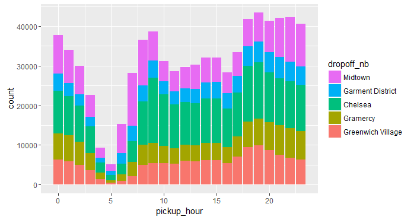

# Exercises

Let's return to one of the questions we asked in the last section: Assuming that a traveler leaves from a given neighborhood, which neighborhoods are they most likely to go to? To answer this question, in we obtained the proportion of trips that fan out into all the different neighborhoods, given that they all start from the same neighborhood. The results are stored in the `rxcs` data. If we sort the data and keep only the relevant columns, it's easier to make sense of it:

```R
rxcs %>%
  select(pickup_nb, dropoff_nb, pct = pct_by_pickup_nb) %>%
  arrange(pickup_nb, desc(pct))
 ```

```Rout
# A tibble: 784 × 3
   pickup_nb         dropoff_nb       pct
      <fctr>             <fctr>     <dbl>
1  Chinatown            Midtown 11.322828
2  Chinatown Financial District  9.755798
3  Chinatown    Lower East Side  8.967900
4  Chinatown       East Village  8.632984
5  Chinatown           Gramercy  8.035631
6  Chinatown  Greenwich Village  7.251824
7  Chinatown            Chelsea  6.614140
8  Chinatown   Garment District  6.065884
9  Chinatown               Soho  4.161017
10 Chinatown            Tribeca  3.981577
# ... with 774 more rows
```

We can see that of all trips out of Chinatown, Midtown is the most common destination (about 11%), followed by the Financial District (about 10%), the Lower East Side (9%), and so on.

(1) Using the pipe operator `%>%` add a few more lines to the above code to do the following:
  - create a new column called `cumpct` representing the cumulative sum of the `pct` column, for each pick-up neighborhood
  - for each pick-up neighborhood, keep only the destinations that are each at least 5% of the share of trips, and that together account for at least half of the trips.
  - dump the results in a `data.frame` called `rxcs_tops`

For example, for Chinatown we should only see the top 6 neighborhoods, because each is a destination at least 5% of the time and together they make up about 54% of the share of destinations leaving from Chinatown.

```Rout
              pickup_nb          dropoff_nb       pct   cumpct
                 <fctr>              <fctr>     <dbl>    <dbl>
1             Chinatown             Midtown 11.322828 11.32283
2             Chinatown  Financial District  9.755798 21.07863
3             Chinatown     Lower East Side  8.967900 30.04653
4             Chinatown        East Village  8.632984 38.67951
5             Chinatown            Gramercy  8.035631 46.71514
6             Chinatown   Greenwich Village  7.251824 53.96696
```

(2) Let's choose West Village as a pick-up neighborhood. From the `mht_xdf` dataset with all the trips, select the subset of trips from this neighborhood and its most common destinations as shown by `rxcs_tops`. 

We use `rxDataStep` along with the `rowSelection` argument to do this, and since we're not specifying the `outFile` argument, our result goes into a `data.frame` which we will call `pickup_df`. We can hard-code this easily, but we want to make the code more dynamic, so that we only choose a neighborhood at the top and let the rest follow. Here's some code to get us started. We can modify it to make it work. As it turns out, if we need to pass any R objects to `rowSelection`, we can do so using the `transformObjects` argument.

```R
nb_name <- "West Village" # a neighborhood of our choosing
nb_drop <- ## pull the most common destinations for this neighborhood from `rxcs_tops`

pickup_df <- rxDataStep(mht_xdf, # we leave out outFile and store results in pickup_df
                        rowSelection = ## select the relevant subset of the data
                        varsToKeep = c("dropoff_nb", "tpep_pickup_datetime"),
                        transformObjects = ## a list, used to pass `nb_name` and `nb_drop` to the rowSelection argument
                        )
```

(3) Let's now look at a stacked bar plot showing the number of drop-offs that happened from West Village into each of its top destination neighborhoods hour by hour. Modify this code so that instead of a stacked bar plot showing the counts (frequencies) of trips in the y-axis, it shows the proportions (relative frequencies) of each destination for that hour, and adds up to 100% for each hour.

```R
pickup_df %>%
  mutate(pickup_hour = hour(ymd_hms(tpep_pickup_datetime, tz = "UTC"))) %>%
  ggplot(aes(x = pickup_hour, fill = dropoff_nb)) +
  geom_bar(position = "stack", stat = "count") +
  scale_fill_discrete(guide = guide_legend(reverse = TRUE))
```


