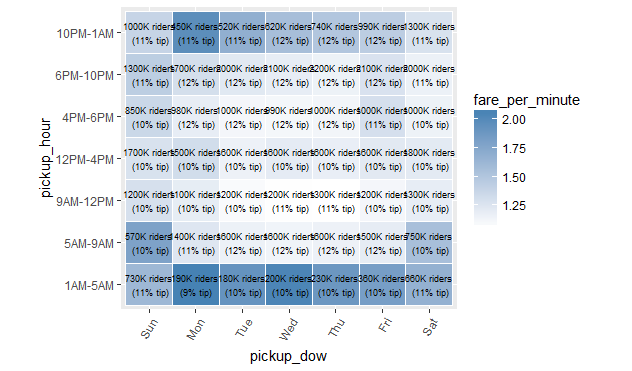

# Time-related patterns

We've so far only focus on spatial patterns, i.e. between the various neighborhoods.  Let's now see what sorts of insights can be derived from temporal columns we extracted from the data, namely the day of the week and the hour the traveler was picked up.

```R
res1 <- rxCube(tip_percent ~ pickup_dow:pickup_hour, mht_xdf)
res2 <- rxCube(fare_amount/(trip_duration/60) ~ pickup_dow:pickup_hour, mht_xdf)
names(res2)[3] <- 'fare_per_minute'
res <- bind_cols(list(res1, res2))
res <- res[ , c('pickup_dow', 'pickup_hour', 'fare_per_minute', 'tip_percent', 'Counts')]

library(ggplot2)
ggplot(res, aes(pickup_dow, pickup_hour)) + 
  geom_tile(aes(fill = fare_per_minute), colour = "white") + 
  theme(axis.text.x = element_text(angle = 60, hjust = 1)) +
  scale_fill_gradient(low = "white", high = "steelblue") +
  geom_text(aes(label = sprintf('%dK riders\n (%d%% tip)', signif(Counts/1000, 2), round(tip_percent, 0))), size = 2.5) + 
  coord_fixed(ratio = .9)
```



We can see from the above plot that a cab ride costs the more on a weekend than a weekday if it's taken between 5 AM and 10 PM, and vice versa from 10 PM to 5 AM.  The plot also suggests that passengers tip slightly more on weekdays and especially right after office hours.  The question of tipping should be more closely looked at, especially since the percentage people tip is affected by whether people use cash or card, which so far we've ignored.


