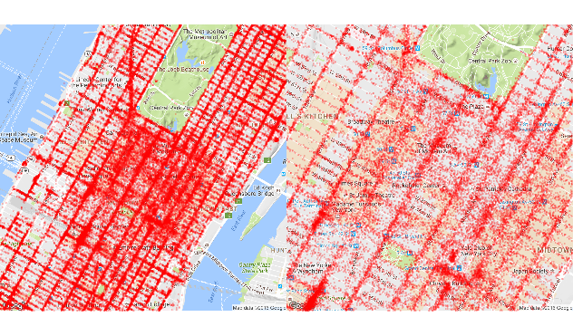

# Looking at maps

We can use the `ggmap` package to visually inspect the sample data.  If we zoom in enough on a particular neighborhood, we can start seeing certain areas where passengers tend of get off often.

```R
library(ggmap)
map_13 <- get_map(location =  c(lon = -73.98, lat = 40.76), zoom = 13)
map_14 <- get_map(location =  c(lon = -73.98, lat = 40.76), zoom = 14)
map_15 <- get_map(location =  c(lon = -73.98, lat = 40.76), zoom = 15)

q1 <- ggmap(map_14) + 
  geom_point(aes(x = dropoff_longitude, y = dropoff_latitude), 
             data = mht_sample_df, alpha = 0.15, na.rm = TRUE, col = "red", size = .5) +
  theme_nothing(legend = TRUE)

q2 <- ggmap(map_15) + 
  geom_point(aes(x = dropoff_longitude, y = dropoff_latitude), 
             data = mht_sample_df, alpha = 0.15, na.rm = TRUE, col = "red", size = .5) +
  theme_nothing(legend = TRUE)

require(gridExtra)
grid.arrange(q1, q2, ncol = 2)
```


