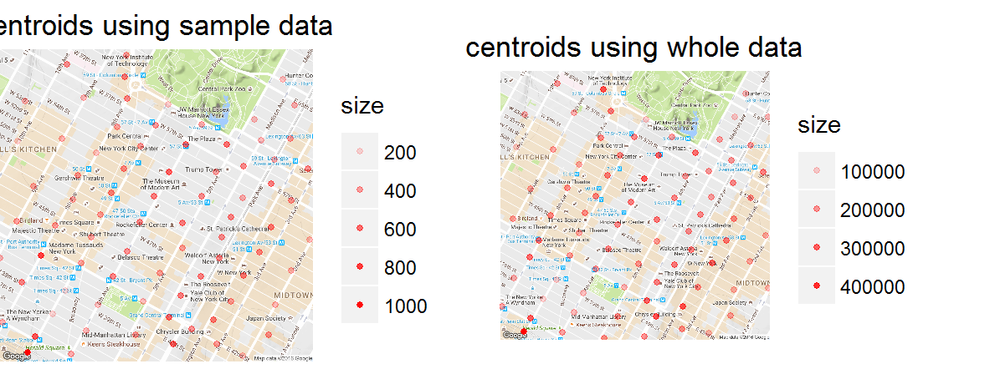

# Creating clusters

If the above plots seem too crowded, as an alternative, we could use **k-means clustering** to cluster the data based on longitude and latitude, which we would have to rescale so they have the same influence on the clusters (a simple way to rescale them is to divide longitude by -74 and latitude by 40).  Once we have the clusters, we can plot the cluster **centroids** on the map instead of the individual data points that comprise each cluster.

```R
xydata <- transmute(mht_sample_df, long_std = dropoff_longitude / -74, lat_std = dropoff_latitude / 40)

start_time <- Sys.time()
rxkm_sample <- kmeans(xydata, centers = 300, iter.max = 2000, nstart = 50)
Sys.time() - start_time

# we need to put the centroids back into the original scale for coordinates
centroids_sample <- rxkm_sample$centers %>%
  as.data.frame %>%
  transmute(long = long_std*(-74), lat = lat_std*40, size = rxkm_sample$size)

head(centroids_sample)
```

```Rout
Time difference of 2.017159 mins

       long      lat size
1 -74.01542 40.71149  277
2 -74.00814 40.71107  443
3 -73.99687 40.72133  335
4 -74.00465 40.75183  475
5 -73.96324 40.77466  589
6 -73.98444 40.73826  424
```

In the above code chunk we used the `kmeans` function to cluster the sample dataset `mht_sample_df`. In `RevoScaleR`, there is a counterpart to the `kmeans` function called `rxKmeans`, but in addition to working with a `data.frame`, `rxKmeans` also works with XDF files.  We can therefore use `rxKmeans` to create clusters from the whole data instead of the sample represented by `mht_sample_df`.

```R
start_time <- Sys.time()
rxkm <- rxKmeans( ~ long_std + lat_std, data = mht_xdf, outFile = mht_xdf, 
                  outColName = "dropoff_cluster", centers = rxkm_sample$centers, 
                  transforms = list(long_std = dropoff_longitude / -74, lat_std = dropoff_latitude / 40),
                  blocksPerRead = 1, overwrite = TRUE, # need to set this when writing to same file
                  maxIterations = 100, reportProgress = -1) 
Sys.time() - start_time

clsdf <- cbind(
  transmute(as.data.frame(rxkm$centers), long = long_std*(-74), lat = lat_std*40),
  size = rxkm$size, withinss = rxkm$withinss)

head(clsdf)
```

```Rout
Time difference of 2.529844 hours

       long      lat   size      withinss
1 -73.96431 40.80540 301784 0.00059328668
2 -73.99275 40.73042 171080 0.00007597645
3 -73.98032 40.76031 198077 0.00005138354
4 -73.98828 40.77187 134539 0.00011077493
5 -73.96651 40.75752 133927 0.00004789548
6 -73.98446 40.74836 186906 0.00005435595
```

With a little bit of work, we can extract the cluster centroids from the resulting object and plot them on a similar map.  As we can see, the results are not very different, however differences do exist and depending on the use case, such small differences can have a lot of practical significance.  If for example we wanted to find out which spots taxis are more likely to drop off passengers and make it illegal for street vendors to operate at those spots (in order to avoid creating too much traffic), we can do a much better job of narrowing down the spots using the clusters created from the whole data.

```R
centroids_whole <- cbind(
  transmute(as.data.frame(rxkm$centers), long = long_std*(-74), lat = lat_std*40),
  size = rxkm$size, withinss = rxkm$withinss)

q1 <- ggmap(map_15) +
  geom_point(data = centroids_sample, aes(x = long, y = lat, alpha = size),
             na.rm = TRUE, size = 1, col = 'red') +
  theme_nothing(legend = TRUE) +
  labs(title = "centroids using sample data")

q2 <- ggmap(map_15) +
  geom_point(data = centroids_whole, aes(x = long, y = lat, alpha = size),
             na.rm = TRUE, size = 1, col = 'red') +
  theme_nothing(legend = TRUE) +
  labs(title = "centroids using whole data")

require(gridExtra)
grid.arrange(q1, q2, ncol = 2)
```


