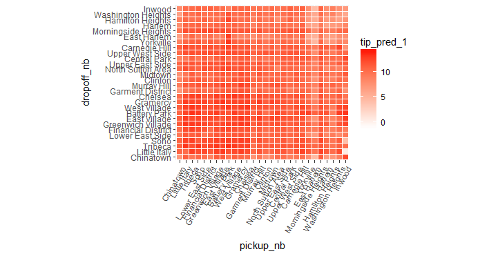

# Examining predictions

We can now visualize the model's predictions by plotting the average predictions for all combinations of the interactive terms.

```R
ggplot(pred_df_1, aes(x = pickup_nb, y = dropoff_nb)) + 
  geom_tile(aes(fill = tip_pred_1), colour = "white") + 
  theme(axis.text.x = element_text(angle = 60, hjust = 1)) +
  scale_fill_gradient(low = "white", high = "red") + 
  coord_fixed(ratio = .9)
```



```R
ggplot(pred_df_1, aes(x = pickup_dow, y = pickup_hour)) + 
  geom_tile(aes(fill = tip_pred_1), colour = "white") + 
  theme(axis.text.x = element_text(angle = 60, hjust = 1)) +
  scale_fill_gradient(low = "white", high = "red") + 
  coord_fixed(ratio = .9)
```


