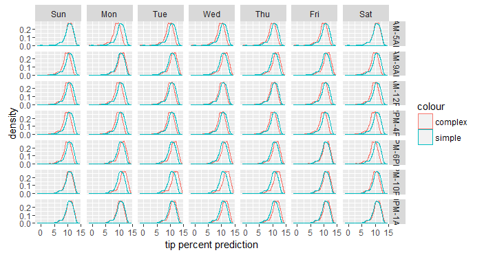
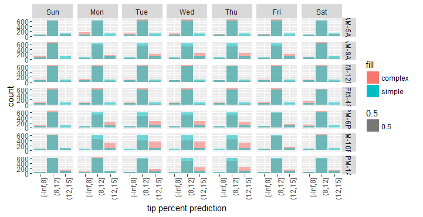

# Choosing between models

A question we might ask ourselves is how important is the interaction between `pickup_dow` and `pickup_hour` to the predictions? How much worse would the predictions be if we only kept the interaction between `pickup_nb` and `dropoff_nb` and dropped the second interactive term? To answer this, we can build a simpler model with `rxLinMod` in which we only include `pickup_nb:dropoff_nb`. We then predict with the simpler model and use `cbind` to append the new predictions next to the data with the old predictions we made with the more complex model.

```R
form_2 <- as.formula(tip_percent ~ pickup_nb:dropoff_nb)
rxlm_2 <- rxLinMod(form_2, data = mht_xdf, dropFirst = TRUE, covCoef = TRUE)
pred_df_2 <- rxPredict(rxlm_2, data = pred_df_1, computeStdErrors = TRUE, writeModelVars = TRUE)
names(pred_df_2)[1:2] <- paste(c('tip_pred', 'tip_stderr'), 2, sep = "_")

pred_df <- pred_df_2 %>% 
  select(starts_with('tip_')) %>%
  cbind(pred_df_1) %>%
  arrange(pickup_nb, dropoff_nb, pickup_dow, pickup_hour) %>% 
  select(pickup_dow, pickup_hour, pickup_nb, dropoff_nb, starts_with('tip_pred_'))

head(pred_df)
```

```Rout
  pickup_dow pickup_hour pickup_nb dropoff_nb tip_pred_2 tip_pred_1
1        Sun     1AM-5AM Chinatown  Chinatown   6.782043   6.796323
2        Sun     5AM-9AM Chinatown  Chinatown   6.782043   5.880284
3        Sun    9AM-12PM Chinatown  Chinatown   6.782043   6.103625
4        Sun    12PM-4PM Chinatown  Chinatown   6.782043   5.913130
5        Sun     4PM-6PM Chinatown  Chinatown   6.782043   6.121957
6        Sun    6PM-10PM Chinatown  Chinatown   6.782043   6.642192
```

We can see from the results above that the predictions with the simpler model are identical across all the days of the week and all the hours for the same pick-up and drop-off combination.  Whereas the predictions by the more complex model are unique for every combination of all four variables.  In other words, adding `pickup_dow:pickup_hour` to the model adds extra variation to the predictions, and what we'd like to know is if this variation contains important signals or if it more or less behaves like noise. To get to the answer, we compare the distribution of the two predictions when we break them up by `pickup_dow` and `pickup_hour`.

```R
ggplot(data = pred_df) +
  geom_density(aes(x = tip_pred_1, col = "complex")) +
  geom_density(aes(x = tip_pred_2, col = "simple")) +
  facet_grid(pickup_hour ~ pickup_dow)
```



The simpler model shows the same distribution all throughout, because these two variables have no effect on its predictions, but the more complex model shows a slightly different distribution for each combination of `pickup_dow` and `pickup_hour`, usually in the form of a slight shift in the distribution. That shift represents the effect of `pickup_dow` and `pickup_hour` at each given combination of the two variables. Because the shift is directional (not haphazard), it's safe to say that it captures some kind of important signal (although its practical significance is still up for debate). We can simplify the above plot if we apply some business logic to it. 

Let's us `cut` to bin the tip predictions. To choose what the cut-offs should be, we can use the `rxQuantile` function to guide us. 

```R
rxQuantile("tip_percent", data = mht_xdf, probs = seq(0, 1, by = .05))
```

```Rout
    0%   5%  10%  15%  20%  25%  30%  35%  40%  45%  50%  55%  60%  65%  70%  75%  80% 
  -1    0    0    0    0    0    0    0    9   12   15   17   17   17   18   18   19 
 85%  90%  95% 100% 
  20   21   23   99 
```

Based on the above results, we can bin `tip_percent` by whether they are less than 8%, between 8% and 12%, between 12% and 15%, between 15% and 18%, or 18% or higher. We can then plot a bar plot showing the same information as above, but slightly easier to interpret.

```R
pred_df %>%
  mutate_at(vars(tip_pred_1, tip_pred_2), funs(cut(., c(-Inf, 8, 12, 15, 18, Inf)))) %>%
  ggplot() +
  geom_bar(aes(x = tip_pred_1, fill = "complex", alpha = .5)) +
  geom_bar(aes(x = tip_pred_2, fill = "simple", alpha = .5)) +
  facet_grid(pickup_hour ~ pickup_dow) +
  xlab('tip percent prediction') +
  theme(axis.text.x = element_text(angle = 90, hjust = 1))
```



Based on the above plot, we can see that compared to the simple model, the complex model tends to predict more high-tipping passengers and fewer average-tipping ones during certain day and time combinations (such as Monday through Thursday during the rush hours).