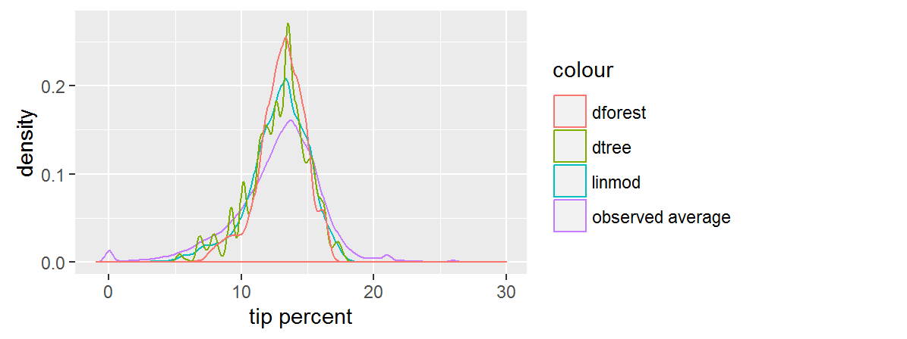

# Comparing predictions

Before applying the algorithm to the test data, let's apply it to the small dataset with all the combinations of categorical variables and visualize the predictions. This might help us develop some intuition about each algorithm.

```R
pred_df <- expand.grid(ll)
pred_df_1 <- rxPredict(trained.models$linmod, data = pred_df, predVarNames = "pred_linmod")
pred_df_2 <- rxPredict(trained.models$dtree, data = pred_df, predVarNames = "pred_dtree")
pred_df_3 <- rxPredict(trained.models$dforest, data = pred_df, predVarNames = "pred_dforest")
pred_df <- do.call(cbind, list(pred_df, pred_df_1, pred_df_2, pred_df_3))
head(pred_df)
```

```Rout
           pickup_nb dropoff_nb pickup_hour pickup_dow pred_linmod pred_dtree pred_dforest
1          Chinatown  Chinatown     1AM-5AM        Sun 6.869645    5.772054   9.008643
2       Little Italy  Chinatown     1AM-5AM        Sun 10.627190   9.221250   10.634590
3            Tribeca  Chinatown     1AM-5AM        Sun 9.063741    9.221250   10.099731
4               Soho  Chinatown     1AM-5AM        Sun 10.107815   8.313437   10.162946
5    Lower East Side  Chinatown     1AM-5AM        Sun 9.728399    9.221250   10.525242
6 Financial District  Chinatown     1AM-5AM        Sun 8.248997    6.937500   8.674807
```


```R
observed_df <- rxSummary(tip_percent ~ pickup_nb:dropoff_nb:pickup_dow:pickup_hour, mht_xdf)
observed_df <- observed_df$categorical[[1]][ , c(2:6)]
pred_df <- inner_join(pred_df, observed_df, by = names(pred_df)[1:4])
  
ggplot(data = pred_df) +
  geom_density(aes(x = Means, col = "observed average")) +
  geom_density(aes(x = pred_linmod, col = "linmod")) +
  geom_density(aes(x = pred_dtree, col = "dtree")) +
  geom_density(aes(x = pred_dforest, col = "dforest")) +
  xlim(-1, 30) + 
  xlab("tip percent")
```



Both the linear model and the random forest give us smooth predictions. We can see that the random forest predictions are the most concentrated. The predictions for the decision tree follow a jagged distribution, probably as a result of overfitting, but we don't know that until we check performance against the test set. Overall, the predictions are more narrow than the observed averages.
